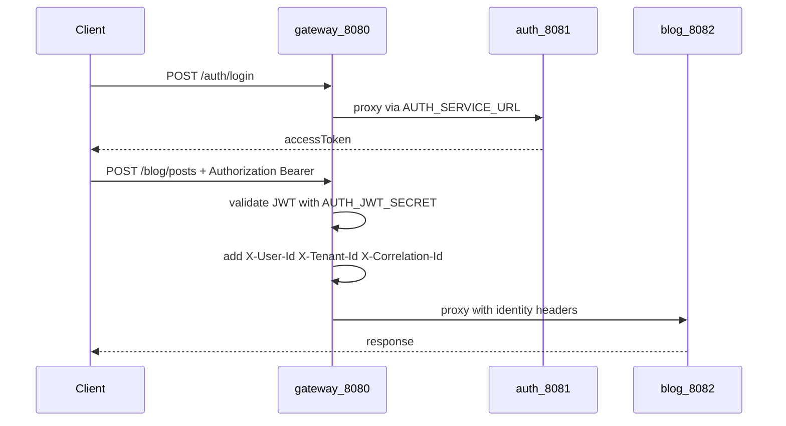

# Blog CMS

**Live:** [blog.mfajardo.com](https://blog.mfajardo.com)

Multi-service blog platform: Spring Cloud Gateway, blog/media/audit APIs, Next.js frontend. Auth is a separate repo: **[auth-service](https://github.com/mc44/auth-service)**.

Architecture: [SYSTEM_DESIGN.md](./SYSTEM_DESIGN.md). Milestones: [docs/ROADMAP.md](./docs/ROADMAP.md). Learning track: [docs/learning/README.md](./docs/learning/README.md).

## 1. Clone

```bash
git clone https://github.com/mc44/blog-cms-microservices.git blog-cms-microservices
cd blog-cms-microservices
```

Deploy **auth-service** first: [auth-service README](https://github.com/mc44/auth-service/blob/main/README.md) and [deploy/README.md](https://github.com/mc44/auth-service/blob/main/deploy/README.md). Auth listens on **8081** and creates Docker network `auth-platform`.

## 2. Configure

```bash
cd 0-deploy
cp .env.example .env
```

| Variable | Requirement |
|----------|-------------|
| `AUTH_JWT_SECRET` | Must match [auth-service deploy/.env.example](https://github.com/mc44/auth-service/blob/main/deploy/.env.example) |
| `BLOG_TENANT_ID` | Tenant at login (default `blog-cms`) |
| `NEXT_PUBLIC_GATEWAY_URL` | `http://localhost:8080` for local |

**Secrets**

- Store only in `0-deploy/.env` (gitignored); on a VPS run `chmod 600 0-deploy/.env`.
- Auth secrets live in auth's deploy env on the auth host — never commit either file.
- Quote values that contain spaces or `'` (e.g. `NEXT_PUBLIC_SITE_BYLINE="by mfajardo"`); unquoted values break `deploy.sh` when it sources `.env`.
- `AUTH_JWT_SECRET` must match auth; restart app containers after changing it.

## 3. Run

From **repo root** (`blog-cms-microservices/`):

**3a — Blog Mongo (once):**

```bash
docker compose --env-file 0-deploy/.env -f 0-deploy/prereqs/docker-compose.yml up -d mongo
```

**3b — Gateway, blog, media, audit, frontend:**

```bash
chmod +x 0-deploy/scripts/deploy.sh 0-deploy/scripts/check-ports.sh
./0-deploy/scripts/check-ports.sh all
./0-deploy/scripts/deploy.sh
```

`deploy.sh` starts application containers only. Auth and Mongo are prerequisites (§1 and 3a).

Optional hot-reload frontend: [3-frontend/README.md](./3-frontend/README.md).

## 4. Verify

```bash
curl -s http://localhost:8080/actuator/health    # {"status":"UP"}
curl -s http://localhost:8080/hello              # Hello from gateway

curl -s -X POST http://localhost:8080/auth/login \
  -H 'Content-Type: application/json' \
  -d '{"tenantId":"blog-cms","email":"user@example.com","password":"change-me"}'
# → JSON with accessToken
```

Open **http://localhost:3000** → Login → create and publish a post.

## FAQ

### How do I pull updates and redeploy?

`git pull` → `./0-deploy/scripts/deploy.sh` from repo root. Restart auth first if auth changed; recreate blog Mongo only if `0-deploy/prereqs/docker-compose.yml` changed. Compare `0-deploy/.env` with `.env.example` after each pull. VPS detail: [0-deploy/README.md](./0-deploy/README.md).

### How does the gateway connect to auth, and how do tokens work?



Gateway joins `auth-platform` and `cms-internal`; `AUTH_SERVICE_URL` proxies `/auth/**` to auth ([application.yml](./1-gateway-service/src/main/resources/application.yml)). Protected routes require `Authorization: Bearer …`; gateway validates with `AUTH_JWT_SECRET` ([SecurityConfig.java](./1-gateway-service/src/main/java/com/operations/gateway/config/SecurityConfig.java)) and forwards `X-User-Id` / `X-Tenant-Id` to downstream services. Detail: [docs/learning/02-auth-sibling-repo.md](./docs/learning/02-auth-sibling-repo.md), [GATEWAY_INTEGRATION.md](https://github.com/mc44/auth-service/blob/main/docs/GATEWAY_INTEGRATION.md).

### Login works but blog writes return 401

`AUTH_JWT_SECRET` mismatch or stale token. Match auth's live secret (see §2), redeploy apps, log in again.

### `auth-platform` network not found

Start auth before `deploy.sh` — [auth-service deploy/README.md](https://github.com/mc44/auth-service/blob/main/deploy/README.md).

### Port check failed / `check-ports.sh` errors

`./0-deploy/scripts/check-ports.sh all` reads `*_HOST_PORT` from `.env` and lists files to edit. Change the host port in `.env` (e.g. `FRONTEND_HOST_PORT=3001`), then redeploy. For a non-default frontend container port, set `FRONTEND_CONTAINER_PORT` and `3-frontend/Dockerfile` `ENV PORT`.

### What must `BLOG_TENANT_ID` match?

The `tenantId` at login; must exist in auth (default seed `blog-cms`).

### Why two Mongo ports (27017 vs 27018)?

Auth Mongo: **27017** ([auth-service](https://github.com/mc44/auth-service)). Blog + audit data: **27018** (`0-deploy/prereqs`).

### Do I need Kafka or Cloudinary?

No for local dev. Default `KAFKA_ENABLED=false` — see [docs/kafka.md](./docs/kafka.md). Media uses in-memory storage without `CLOUDINARY_*` in `.env`.

### Should clients call blog-service on :8082 directly?

No — use gateway **:8080** for browser and API traffic.

### Frontend: Docker vs `npm run dev`?

`deploy.sh` serves the frontend on port 3000. Hot reload: `npm run dev` in `3-frontend/` with `NEXT_PUBLIC_GATEWAY_URL=http://localhost:8080`.

## Deploy on a server

VPS: [0-deploy/README.md](./0-deploy/README.md).

## Module docs

| Folder | README |
|--------|--------|
| `0-deploy/` | [0-deploy/README.md](./0-deploy/README.md) |
| `1-gateway-service/` | [1-gateway-service/README.md](./1-gateway-service/README.md) |
| `2-blog-service/` | [2-blog-service/README.md](./2-blog-service/README.md) |
| `3-frontend/` | [3-frontend/README.md](./3-frontend/README.md) |
| `4-media-service/` | [4-media-service/README.md](./4-media-service/README.md) |
| `5-audit-service/` | [5-audit-service/README.md](./5-audit-service/README.md) |

Optional Kafka: [docs/kafka.md](./docs/kafka.md).
