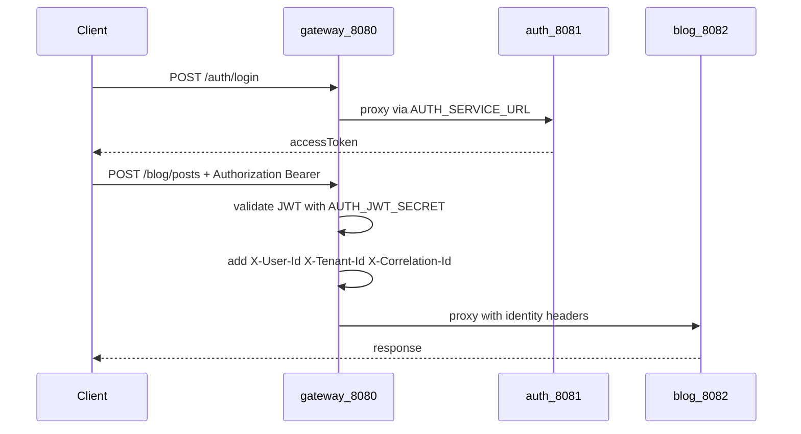

# Blog CMS

Multi-service blog platform: Spring Cloud Gateway, blog/media/audit APIs, Next.js frontend. Auth is a separate repo: **[auth-service](https://github.com/mc44/auth-service)**.

Architecture: [SYSTEM_DESIGN.md](./SYSTEM_DESIGN.md). Milestones: [docs/ROADMAP.md](./docs/ROADMAP.md). Learning track: [docs/learning/README.md](./docs/learning/README.md).

## 1. Clone

```bash
git clone <this-repo-url> blog-cms-microservices
cd blog-cms-microservices
```

Deploy **auth-service** first — clone and run steps: [auth-service README](https://github.com/mc44/auth-service/blob/main/README.md) and [deploy/README.md](https://github.com/mc44/auth-service/blob/main/deploy/README.md). Auth listens on **8081** and creates Docker network `auth-platform`.

## 2. Configure

```bash
cd 0-deploy
cp .env.example .env
```

| Variable | Requirement |
|----------|-------------|
| `AUTH_JWT_SECRET` | Must match [auth-service deploy/.env.example](https://github.com/mc44/auth-service/blob/main/deploy/.env.example) |
| `BLOG_TENANT_ID` | Tenant at login (default `blog-cms`) |
| `NEXT_PUBLIC_GATEWAY_URL` | `http://localhost:8080` for local |

Secrets only in `0-deploy/.env` (gitignored). See [docs/SECURITY.md](./docs/SECURITY.md).

## 3. Run

Blog Mongo (once):

```bash
cd 0-deploy/prereqs && docker compose up -d mongo
```

Start the stack (from repo root):

```bash
chmod +x 0-deploy/scripts/deploy.sh 0-deploy/scripts/check-ports.sh
./0-deploy/scripts/deploy.sh
```

Optional hot-reload frontend: [3-frontend/README.md](./3-frontend/README.md).

## 4. Verify

```bash
curl -s http://localhost:8080/actuator/health    # {"status":"UP"}
curl -s http://localhost:8080/hello              # Hello from gateway

curl -s -X POST http://localhost:8080/auth/login \
  -H 'Content-Type: application/json' \
  -d '{"tenantId":"blog-cms","email":"user@example.com","password":"change-me"}'
# → JSON with accessToken
```

Open **http://localhost:3000** → Login → create and publish a post.

## FAQ

### How do I pull updates and redeploy?

**This repo:** `git pull` then `./0-deploy/scripts/deploy.sh` from the repo root (rebuilds app containers). Blog Mongo in `0-deploy/prereqs` usually stays up unless `docker-compose.yml` there changed.

**Auth:** `git pull` in your auth clone, then redeploy per [auth-service deploy/README.md](https://github.com/mc44/auth-service/blob/main/deploy/README.md).

**Order:** auth first if auth changed → blog Mongo if prereqs changed → `./0-deploy/scripts/deploy.sh`.

**VPS:** `cd 0-deploy && git pull && ./scripts/deploy.sh`. CI can also deploy pre-built images when `VPS_DEPLOY_ENABLED` is set.

After any pull, compare `0-deploy/.env` with `0-deploy/.env.example` — add any new variables locally (never commit `.env`).

### How does the gateway connect to auth, and how do tokens work?



- **Connect:** Gateway joins Docker networks `auth-platform` and `cms-internal`. `AUTH_SERVICE_URL=http://auth-service:8081` proxies `/auth/**` to auth ([application.yml](./1-gateway-service/src/main/resources/application.yml)).
- **Login:** Public at the gateway; auth issues the JWT; the browser stores `accessToken`.
- **Protected routes:** Client sends `Authorization: Bearer …`. Gateway validates with `AUTH_JWT_SECRET` ([SecurityConfig.java](./1-gateway-service/src/main/java/com/operations/gateway/config/SecurityConfig.java)), then adds `X-User-Id` and `X-Tenant-Id` for blog/media/audit.
- **More detail:** [GATEWAY_INTEGRATION.md](https://github.com/mc44/auth-service/blob/main/docs/GATEWAY_INTEGRATION.md), [docs/learning/02-auth-sibling-repo.md](./docs/learning/02-auth-sibling-repo.md).

### Login works but blog writes return 401

`AUTH_JWT_SECRET` in `0-deploy/.env` must match the value in [auth-service deploy/.env.example](https://github.com/mc44/auth-service/blob/main/deploy/.env.example) (or your auth server's live `.env`). Restart apps after changing it.

### `auth-platform` network not found

Start auth before `./0-deploy/scripts/deploy.sh` — see [auth-service deploy/README.md](https://github.com/mc44/auth-service/blob/main/deploy/README.md).

### What must `BLOG_TENANT_ID` match?

The `tenantId` you use at login. It must exist in auth (default seed `blog-cms` if you use auth's default seed settings).

### Why two Mongo ports (27017 vs 27018)?

Auth Mongo runs with auth ([auth-service](https://github.com/mc44/auth-service)) on **27017**. This repo's blog + audit data use Mongo on **27018** via `0-deploy/prereqs`.

### Do I need Kafka?

No. Default is `KAFKA_ENABLED=false`. See [docs/kafka.md](./docs/kafka.md) to enable Redpanda.

### Do I need Cloudinary?

No for local dev — media-service uses in-memory storage. Set `CLOUDINARY_*` in `0-deploy/.env` for persistent production uploads.

### Should clients call blog-service on :8082 directly?

Use the gateway on **:8080** for all browser and API traffic. Direct service ports are for debugging only.

### Frontend: Docker vs `npm run dev`?

Docker frontend comes from `deploy.sh` on port 3000. For hot reload: `npm run dev` in `3-frontend/` with `NEXT_PUBLIC_GATEWAY_URL=http://localhost:8080`.

### Where do secrets live?

`0-deploy/.env` in this repo and auth's deploy env on the auth server — see [docs/SECURITY.md](./docs/SECURITY.md).

## Deploy on a server

Full VPS steps: [0-deploy/README.md](./0-deploy/README.md).

## Module docs

| Folder | README |
|--------|--------|
| `0-deploy/` | [0-deploy/README.md](./0-deploy/README.md) |
| `1-gateway-service/` | [1-gateway-service/README.md](./1-gateway-service/README.md) |
| `2-blog-service/` | [2-blog-service/README.md](./2-blog-service/README.md) |
| `3-frontend/` | [3-frontend/README.md](./3-frontend/README.md) |
| `4-media-service/` | [4-media-service/README.md](./4-media-service/README.md) |
| `5-audit-service/` | [5-audit-service/README.md](./5-audit-service/README.md) |

Optional Kafka: [docs/kafka.md](./docs/kafka.md).
