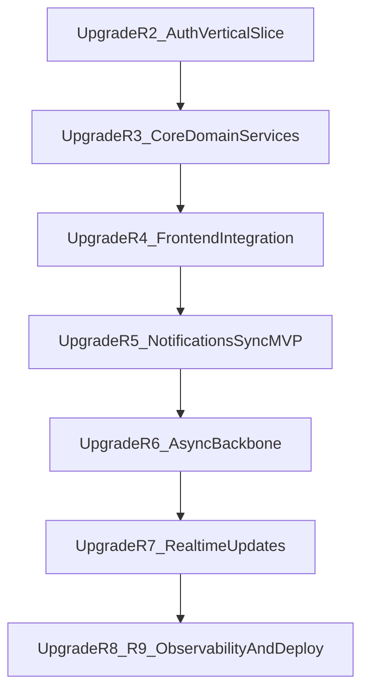

# 02 - Level-Up Iterations Index

This is the navigation hub for your portfolio-grade upgrades after `01-foundations.md`.

Each upgrade file is a full playbook with:

- entry criteria
- step-by-step implementation order
- concrete commands
- verification and failure drills
- measurable definition of done
- portfolio evidence checklist

## Upgrade sequence (Roadmap R2-R9)

1. [05-upgrade-r2-auth-vertical-slice.md](./05-upgrade-r2-auth-vertical-slice.md)
2. [06-upgrade-r3-core-domain-services.md](./06-upgrade-r3-core-domain-services.md)
3. [07-upgrade-r4-frontend-integration.md](./07-upgrade-r4-frontend-integration.md)
4. [08-upgrade-r5-notifications-sync-mvp.md](./08-upgrade-r5-notifications-sync-mvp.md)
5. [09-upgrade-r6-async-backbone.md](./09-upgrade-r6-async-backbone.md)
6. [10-upgrade-r7-realtime-updates.md](./10-upgrade-r7-realtime-updates.md)
7. [11-upgrade-r8-r9-observability-deploy-hardening.md](./11-upgrade-r8-r9-observability-deploy-hardening.md)

## Milestone flow

## Alignment reminders

- Keep Phase 1 runtime minimal by default: `gateway`, `mongo`, and `redis`.
- Add Kafka/RabbitMQ via later-phase profiles or override files only.
- Preserve per-service logical MongoDB boundaries as new services are implemented.
