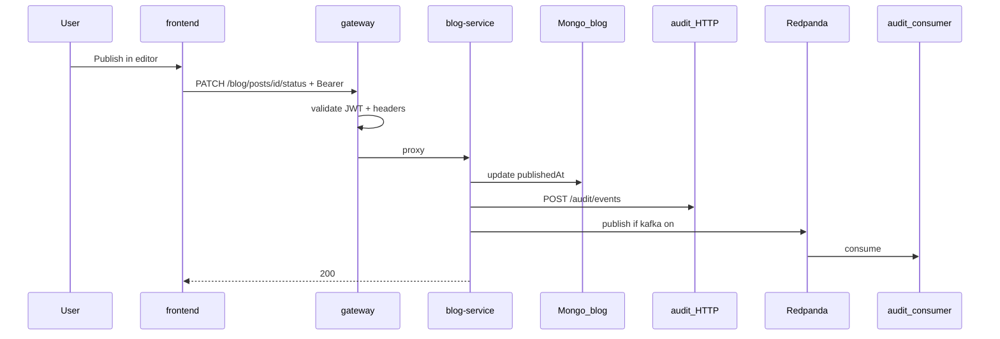

# 09 — End-to-end publish trace

## Goal

Trace one action — publishing a post from the UI — across every layer.

## Prerequisites

Modules [01](./01-deploy.md) through [08](./08-kafka-redpanda.md).

## Scenario

Author logged in → edit draft → status **PUBLISHED** → save.

## Sequence

## Open these files in order

| Step | File |
|------|------|
| 1 | [`3-frontend/src/components/post-editor.tsx`](../../3-frontend/src/components/post-editor.tsx) |
| 2 | [`3-frontend/src/app/posts/[id]/edit/page.tsx`](../../3-frontend/src/app/posts/[id]/edit/page.tsx) |
| 3 | [`3-frontend/src/lib/api.ts`](../../3-frontend/src/lib/api.ts) |
| 4 | [`3-frontend/src/lib/auth.ts`](../../3-frontend/src/lib/auth.ts) |
| 5 | [`1-gateway-service/.../SecurityConfig.java`](../../1-gateway-service/src/main/java/com/operations/gateway/config/SecurityConfig.java) |
| 6 | [`1-gateway-service/.../CorrelationIdGatewayFilter.java`](../../1-gateway-service/src/main/java/com/operations/gateway/filter/CorrelationIdGatewayFilter.java) |
| 7 | [`2-blog-service/.../PostService.java`](../../2-blog-service/src/main/java/com/operations/blog/service/PostService.java) |
| 8 | [`2-blog-service/.../AuditClient.java`](../../2-blog-service/src/main/java/com/operations/blog/client/AuditClient.java) |
| 9 | [`2-blog-service/.../BlogEventPublisher.java`](../../2-blog-service/src/main/java/com/operations/blog/messaging/BlogEventPublisher.java) |
| 10 | [`5-audit-service/.../BlogDomainEventConsumer.java`](../../5-audit-service/src/main/java/com/operations/audit/kafka/BlogDomainEventConsumer.java) |

## Hands-on

1. Set `X-Correlation-Id: trace-001` on publish request.
2. Publish one post.
3. `curl` audit events; find matching `correlationId`.
4. `docker compose -f 0-deploy/docker-compose.yml logs blog-service audit-service | head -50`

## Verify

Post is public on `/posts`. Audit event exists with same correlation id.

## Checkpoint

1. At which hop is the JWT validated?
2. Which header ties logs across services?
3. Name two ways an audit row can be created after publish.
4. Why does public GET /posts not need login?
5. Which service writes to the `blog` database?

## Next

[appendix-commands.md](./appendix-commands.md) — daily command cheat sheet.
