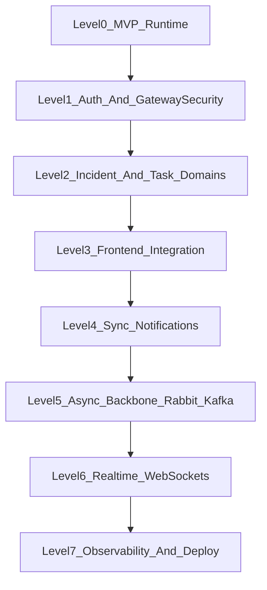

# Microservices Learning Curriculum

This curriculum is designed to help you learn by building in progressive levels, from a minimal runnable stack to more advanced microservices patterns.

Use this in order:

1. [01-foundations.md](./01-foundations.md)
2. [02-level-up-iterations.md](./02-level-up-iterations.md)
3. [05-upgrade-r2-auth-vertical-slice.md](./05-upgrade-r2-auth-vertical-slice.md)
4. [06-upgrade-r3-core-domain-services.md](./06-upgrade-r3-core-domain-services.md)
5. [07-upgrade-r4-frontend-integration.md](./07-upgrade-r4-frontend-integration.md)
6. [08-upgrade-r5-notifications-sync-mvp.md](./08-upgrade-r5-notifications-sync-mvp.md)
7. [09-upgrade-r6-async-backbone.md](./09-upgrade-r6-async-backbone.md)
8. [10-upgrade-r7-realtime-updates.md](./10-upgrade-r7-realtime-updates.md)
9. [11-upgrade-r8-r9-observability-deploy-hardening.md](./11-upgrade-r8-r9-observability-deploy-hardening.md)
10. [03-checkpoints-and-skills.md](./03-checkpoints-and-skills.md)
11. [04-command-reference.md](./04-command-reference.md)
12. [12-portfolio-packaging-checklist.md](./12-portfolio-packaging-checklist.md)

## Learning outcomes

By the end of this track, you should be able to:

- Run a minimal microservices baseline locally using Docker Compose.
- Explain why Phase 1 is intentionally small (gateway + MongoDB + Redis).
- Plan and execute iterative service expansion without overengineering.
- Apply event-driven and real-time patterns at the right time.
- Build stronger production habits around observability and deployment.

## How to study this curriculum

- Spend 60-90 minutes on each level and complete every checkpoint.
- Type commands manually at least once before copy/pasting.
- Keep notes after each level: what broke, how you debugged it, what you learned.
- Repeat startup and teardown until the flow feels natural.

## Progression map

## Source of truth

These guides align to:

- [../../README.md](../../README.md)
- [../../SYSTEM_DESIGN.md](../../SYSTEM_DESIGN.md)
- [../ROADMAP.md](../ROADMAP.md)
- [../../infrastructure/docker/README.md](../../infrastructure/docker/README.md)
- [../../infrastructure/docker/docker-compose.yml](../../infrastructure/docker/docker-compose.yml)
