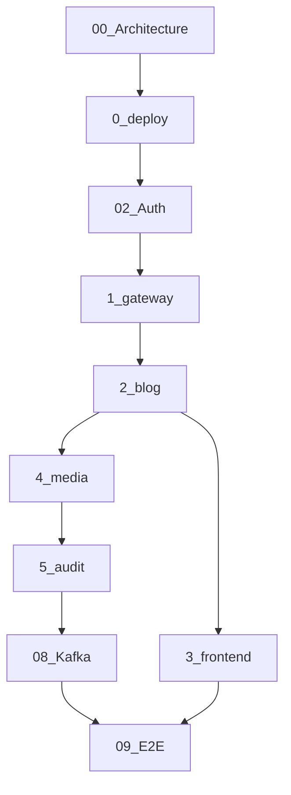

# Blog CMS learning curriculum

Ground-up study path for the live stack: [auth-service](https://github.com/mc44/auth-service) + numbered folders `0-deploy` → `5-audit-service`, optional Redpanda/Kafka.

**Last aligned with:** [docs/ROADMAP.md](../ROADMAP.md).

## Prerequisites

- Docker Compose v2
- Basic HTTP and JSON
- Deploy **[auth-service](https://github.com/mc44/auth-service)** per its [README](https://github.com/mc44/auth-service/blob/main/README.md)
- Secrets: [docs/SECURITY.md](../SECURITY.md) — never commit `0-deploy/.env`

## Modules

| # | Module | Folder |
|---|--------|--------|
| 00 | [Architecture and repos](./00-architecture-and-repos.md) | (overview) |
| 01 | [Deploy](./01-deploy.md) | `0-deploy/` |
| 02 | [Auth sibling repo](./02-auth-sibling-repo.md) | [auth-service](https://github.com/mc44/auth-service) |
| 03 | [Gateway service](./03-gateway-service.md) | `1-gateway-service/` |
| 04 | [Blog service](./04-blog-service.md) | `2-blog-service/` |
| 05 | [Frontend](./05-frontend.md) | `3-frontend/` |
| 06 | [Media service](./06-media-service.md) | `4-media-service/` |
| 07 | [Audit service](./07-audit-service.md) | `5-audit-service/` |
| 08 | [Kafka / Redpanda](./08-kafka-redpanda.md) | `0-deploy/prereqs` |
| 09 | [End-to-end publish trace](./09-end-to-end-publish-trace.md) | all |

### Appendices

- [Command reference](./appendix-commands.md)
- [Code map](./appendix-code-map.md)
- [Deferred topics](./appendix-deferred-topics.md)

## How to study

1. Follow **00 → 09** in order the first time.
2. Run every **Hands-on** block with the stack up ([01 — Deploy](./01-deploy.md)).
3. Use **Verify** sections to confirm each module before moving on.
4. Bookmark [appendix-commands.md](./appendix-commands.md) for daily use.

## Progression

## Source of truth

- [README.md](../../README.md) — clone to working UI
- [0-deploy/README.md](../../0-deploy/README.md) — server deploy
- [SYSTEM_DESIGN.md](../../SYSTEM_DESIGN.md) — product architecture
